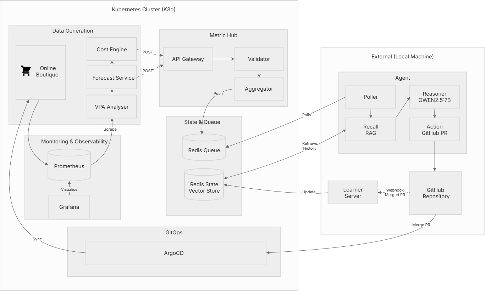

# AI-Driven Kubernetes Cost Optimser
Autonomous system that reduces cloud costs by right-sizing Kubernetes resources using time-series forecasting and 
retrieval-augmented generation (RAG), with built-in safety controls.

Instead of presenting a final sanitised version of the product, details on system design, proposed designs, and both successful outcomes 
and rejected approaches are all documented.

In this README:
* [The Problem](#the-problem)
* [System Components](#system-components)
* [Architecture](#architecture)
* [Agent Lifecycle](#agent-lifecycle)
* [Scope, Constraints, and Implementation Decisions](#scope-constraints-and-implementation-decisions)
* [Project Status](#project-status)
* [Further Reading](#further-reading)

<!--* [Future Work and Some Reflection](#future-work-and-some-reflection)-->

## The Problem
"You pay for what you request, not what you use."

Over-provisioned pods waste money. Under-provisioned pods crash.

Consider a single VM that costs $0.04/hour, with 2 vCPU and 4 GiB RAM available. Whether workloads consume 90% of those resources or just 10%, the VM still costs $0.04/hour. From the cloud provider’s perspective, that capacity is reserved. At the pod level, this means resource requests and limits directly determine how much VM capacity is consumed. Over-requesting resources leads to underutilised nodes and wasted spend.

* **Low traffic + high requests** = idle capacity, wasted spend
* **High traffic + conservative limits** = throttling, OOM, degraded performance

Existing tools do not solve this when cost appears to be a priority:
* **HPA/KEDA** scale replicas but don't fix over-provisioned requests
* **VPA** adjusts resources reactively but can be disruptive
* **Cluster Autoscaler** provisions nodes based on inflated requests

**This project aims to reduce Kubernetes infrastructure costs by eliminating the gap between reserved capacity and actual resource consumption without degrading application performance.**

## System Components
[Google's Online Boutique](https://github.com/GoogleCloudPlatform/microservices-demo) serves as the sample workload in `default` namespace to provide varied workload patterns to validate the optimisation approach.

The system runs as a continuous, event-driven loop across four layers:

### 1. Observability and Data Generation
* **K3d cluster** hosts Online Boutique application and supporting services across one control plane and two worker nodes
* **Prometheus** scrapes CPU/memory metrics, capturing container usage, and resource requests 
* **Grafana** displays optimisation impact, cost comparisons, resource utilisation, waste percentages, and forecasted demand
* **Cost Engine** queries Prometheus for resource requests, calculates VM requirements, and exposes cost metrics 
* **Forecast Service** retrieves historical usage, trains Prophet models, predicts resource requirements for next twenty-four hours
* **VPA Analyser** queries Kubernetes API for VPA recommendations without injecting changes

### 2. Data Ingestion, Aggregation, and Dispatch
* **Metric Hub** validates payloads, merges asynchronous cost and forecast streams, evaluates thresholds using business logic
* **Redis Stack** stores cost/forecast snapshots, manages job queue, provides vector search for Agent's RAG system

### 3. Reasoning and Execution
* **Ollama** runs Qwen 2.5 (7B) model locally for agent reasoning without external API dependencies
* **Agent** polls queue, retrieves past optimisations via RAG, generates patches using CoT prompting, creates GitHub PRs
* **Learner Server** listens for webhook events from GitHub repo, extracts reasoning from merged PRs, stores success embeddings in Redis Stack

### 4. Continuous Delivery
* **GitHub** stores deployment manifests, enforces PR review workflow before cluster changes
* **ArgoCD** watches the Git repo and applies merged changes to the cluster

## Architecture 

## Agent Lifecycle
A detailed breakdown of the agent's state machine and execution flow: [Agent Design](./docs/agent-design.md)

## Scope, Constraints and Implementation Decisions
The system adheres to best practices such as separation of concerns and keeping the codebase modular for testability and future extensibility. 

**Scope:**
* This project focuses exclusively on optimising CPU and memory requests for individual Kubernetes pods defined in a single namespace where the sample workload runs
* The project assumes some fixed replica counts, where possible, to target vertical resource efficiency rather than horizontal scaling
* The project assumes a conscious trade-off between stability and efficiency
* System performance is evaluated against VPA (Vertical Pod Autoscaler) recommendations as a baseline

**Constraints:**
* Cost calculations are simplied and based on a single VM pricing model rather cloud provider billing APIs
* Development and testing runs on WSL, which constrains available resources and performance for testing larger workloads
* The implementation prioritises the core optimisation pipeline over production-grade hardening (e.g. security policies, node affinity , etc)

**Implementation Decisions:**

The current infrastructure only contains basic secret management. It does not include, and is not limited to some of the best/advanced practices such as:
* Control plane harderning, security policies, node affinity 
* Scheduling policies (Taints/tolerations)
* Rate limiting, TLS configuration
* Automated Grafana dashboard provisioning

or any sort of design that introduces additional complexity and overhead towards the development of this project.

> **Note:** This is a prototype demonstrating feasibility of AI-driven Kubernetes cost optimisation. It is **not production-ready.**

## Project Status
- [x] Infrastructure deployed and operational 
- [x] Optimisation pipeline functional  
- [x] Agent successfully creates PRs with reasoning  
- [x] Feedback loop captures validated decisions  
- [x] Agent successfully retrieves relevant past optimisation from memory (RAG)  
- [ ] Fine-tuning LLM prompt for waste reduction accuracy  
- [ ] Evaluation against VPA baseline in progress  

## Further Reading
* [Agent Design](./docs/agent-design.md) - Agent lifecycle design and state machine 
* [Cost Model](./docs/cost-model.md) - Cost calculation methodology
* [Metric Hub](./docs/metric-hub.md) - Metric Hub design 
* [Proposed Designs](./docs/proposed-designs.md) - Previously proposed designs, rejected approaches, challenges, and outcomes
<!--* [Testing Strategy](./docs/testing.md) - Test strategies and validation -->

<!--
## Future Work and Some Reflection
This project started simply out of curiousity. Because I wanted to know whether an agent could reduce Kubernetes cost and thought it'll be interesting to take on this challenge, albeit I don't have any production experience and with tools like KEDA or CA.  The current system remains a prototype, validated using a sample workload, and is still undergoing continuous improvements. Since it is designed with extensibility in mind to support broader deployment scenarios and more robust operational features, one could extend and swap out concrete implementations such as the Redis Queue.

Some potential extensions include:
* Extend to multi-namespace cost aggregation
* Integrate with external observability tools
* Support multiple cloud providers (AWS, GCP, Azure)
* Allowing configuration through a single YAML file for containing VM types, names, and provider details to decouple the system from cluster-specific assumptions
* Add priority queuing for risk-based alert handling

It's unlikely that I would be maintaining this as a long-term maintained project. There are other areas I would rather focus on exploring and improving next. However, i'll come back to this project from time to time in the near future to see what kind of changes I could make from the new experiences I look forward to.

_Hi job market, pls be kind_ (┳◡┳)

### Ok but with that said (눈_눈) 
This is one of the first times I have designed and implemented a system from start to finish. It's not the best, there are certainly better ways to do this, and in a more realistic production setting, I expect tools and data to be more diverse and complex than this.

But for the scope of this project, I'm genuinely really satisfied with the outcome ┐(´～｀)┌ 

I've given my all using the cards at hand and learned a lot through this project. What more could I have asked for? _Probably some more feedback_   

The next project will likely focus on improving developer experience, inspired by on one of the challenges found here. Probably something that can spin up a test environment in the cluster to test code before creating some pull request or pushing changes, and destroy automatically when its done.

Anyway, thuo shalt end here.

I rest my case.

~ Ian (シ_ _)シ

_"It works on my machine"_-->

> **Note**: This is an independent project, not affiliated with Google or any cloud provider.