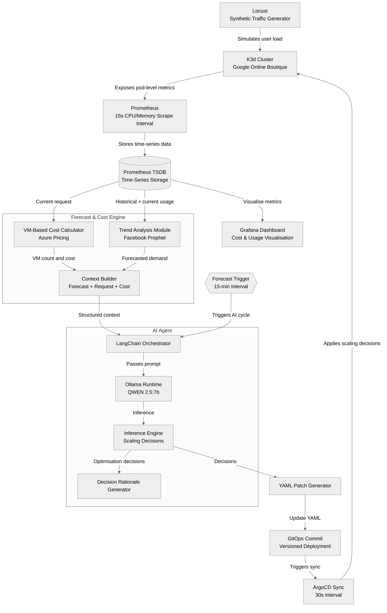

# AI-Driven Kubernetes Cost Optimser
An autonomous system that reduces cloud costs by dynamically right-sizing Kubernetes
resources, eliminating over-provisioning without performance degradation.

In this README:
* [How it works](#how-it-works)
* [Architecture overview](#architecture-overview)
* [More Information](#more-information)
<!--* [Install](#install)-->


## How it works
The system operates on a core design principle: **we assume fixed replica counts to optimise resource requests**, eliminating over-provisioning at its source. This focuses the optimisation on the fundamental unit of cost (i.e. individual pod request), rather than multiplying inefficiency by scaling replica counts. It functions as a continuous feedback loop with components running at different intervals: 

### Monitoring and Analysis
* **Prometheus** scrapes pod CPU/memory usage from a k3d cluster every **15 seconds**
* The **Forecast Engine** continuously analyses trends using Facebook Prophet
* The **Cost Engine** constantly calculates infrastructure cost based on current resource requests
* **Grafana** visualises cost, metrics, requests, etc,.

### AI Agent 
* The **AI Agent** is triggered every 15 mins, receiving a context of: forecasted demand, current usage, resource requests, and cost analysis.
* The agent **decides new, optimised resource requests** for individual pods 
* It generates an **explainable rationale** for each change.
* Decisions are committed as **YAML manifests to Git**.

### GitOps Deployment 
* **ArgoCD** automatically detects the Git commit and syncs the changes to the cluster.
* Every modification is **versioned, auditable, and reversible**.

## Architecture overview

<!--## Install
1. **Start by cloning the repository**
```bash
git clone https://github.com/ianwong123/kubernetes-cost-optimiser.git
cd kubernetes-cost-optimiser
```

2. **Run the installation script**
```bash
./system.sh
```
-->

## More information
Here are some other documents you may wish to read:
* [cost-model.md](cost-model.md)
* agent-internal-workflow.md (TBA)

> Note: This is not a google project. This is an independent project and is still a work in progress.