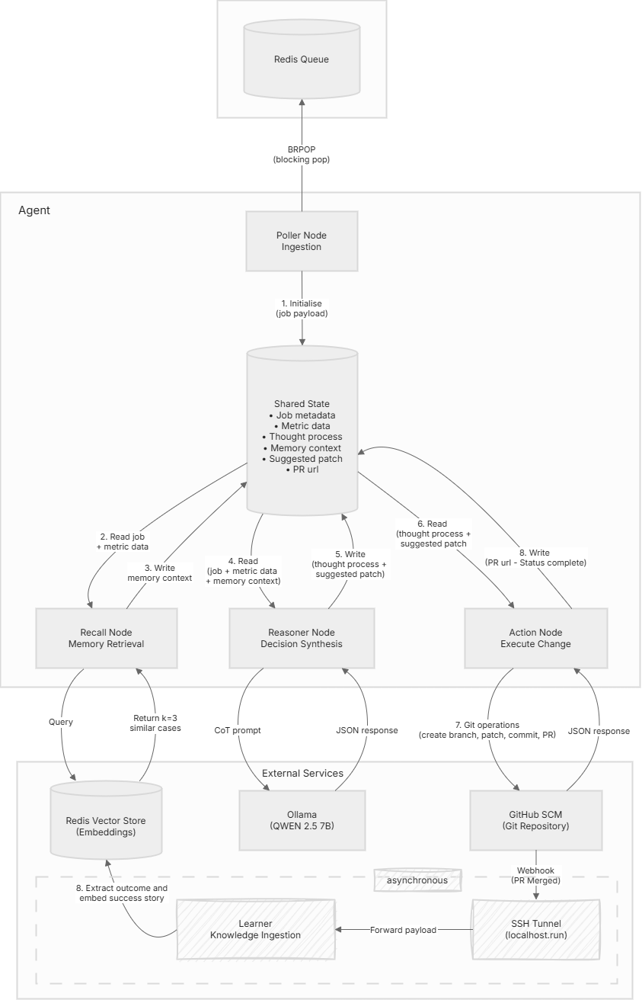
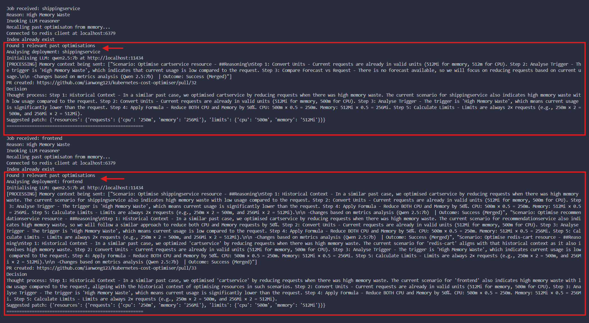
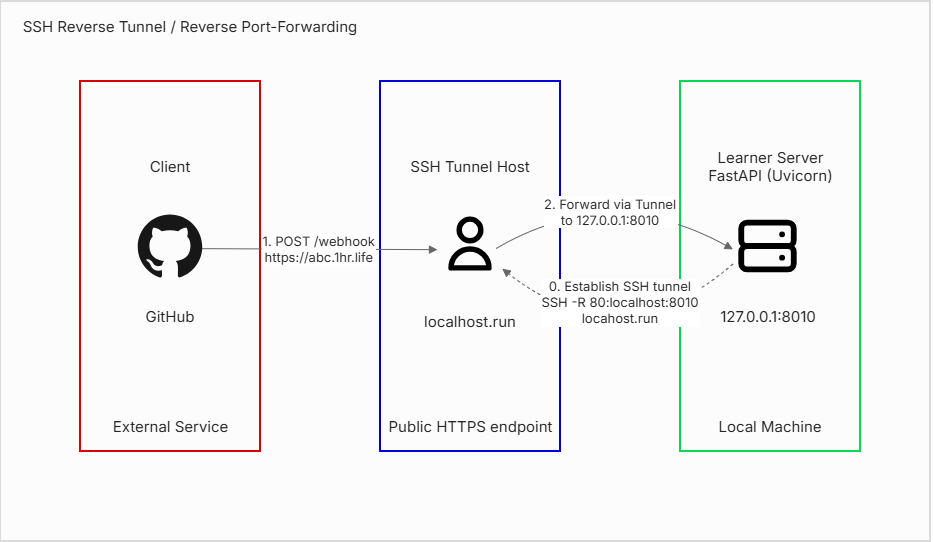

# Agent Design
This document details the autonomous agent's architecture, execution flow, and decision-making process. The agent operates as a state machine that consumes optimisation jobs, reasons about resource changes using retrieval-augmented generation (RAG), and proposes safe modifications through GitHub Pull Requests.

In this document:
* [Overview](#overview)
* [Design](#design)
* [State Machine](#state-machine)
* [Node Responsibilities](#node-responsibilities)
* [Memory and Learning](#memory-and-learning)
* [Safety Mechanisms](#safety-mechanisms)
* [Integrating Webhooks](#integrating-webhooks)

## Overview
The agent runs outside the Kubernetes cluster and connects to Redis via port-forwarding. It operates in two independent streams:

1. Optimiser Stream: Actively polls the job queue, reasons about changes, creates Pull Requests
2. Learner Stream: Passively listens for webhook events when PRs merge, stores validated decisions

This separation allows the agent to process new jobs immediately while learning from past decisions asynchronously, without blocking on human review cycles.

## Design
The agent follows the **Blackboard Architectural Pattern**, where specialised nodes read from and write to a shared state object. Each node performs a focused operation, updates the state, then transfers control to the next node. This creates a deterministic execution path while maintaining loose coupling between cognitive operations.


## State Machine
The agent progresses through four sequential phases, with data flowing between nodes via a shared state object.



### Phase 1: Job Ingestion (Poller Node)
The Poller performs a blocking pop (BRPOP) on the Redis queue `queue:agent:jobs`. When a job arrives:
1. Validates the job schema
2. Initialises the shared state with job metadata (deployment name, namespace, trigger reason, metrics)
3. Transfers control to Recall Node

**Example Job Payload:**
```
{
  "reason": "High Memory Waste",
  "namespace": "default",
  "cluster_info": {"vm_count": 3, "current_hourly_cost": 0.12}
  "deployments": {
    "name": "currencyservice",
    "current_requests": {"cpu_cores": 0.512, "memory_mb": 512},
    "current_usage": {"cpu_cores": 0.033, "memory_mb": 115}
  },
}
```

### Phase 2: Contextual Recall (Recall Node)
The Recall Node implements Retrieval-Augmented Generation (RAG):
1. Converts the job description into a 384-dimensional vector embedding using `all-MiniLM-L6-v2`
2. Queries Redis Vector Store using K-Nearest-Neighbors (KNN) with cosine similarity
3. Retrieves the top 3 similar historical optimisation cases
4. Updates shared state with retrieved context

### Phase 3: LLM Reasoning (Reasoner Node)
The Reasoner constructs a Chain-of-Thought (CoT) prompt combining:
1. Current deployment metrics
2. Historical context from Recall Node
3. Explicit reasoning rules for each trigger type
The prompt is sent to Ollama (Qwen 2.5 7B running locally). The model returns structured JSON:
```
{
  "thought_process": "Step 1: Convert Units (512m = 0.512 cores)...",
  "suggested_changes": {
    "resources": {
      "requests": {"cpu": "256m", "memory": "256Mi"},
      "limits": {"cpu": "512m", "memory": "512Mi"}
    }
  }
}
```

**Validation Layer:**  
Before accepting the output, the Reasoner validates:
- Limits ≥ Requests
- For "Waste" triggers: New request < Current request
- For "Risk" triggers: New request > Current request
- No hallucinated 10x increase in resources

Failed validation returns an empty patch, skipping PR creation.

### Phase 4: GitHub Integration (Action Node)
The Action Node executes the Git workflow:
1. Creates a uniquely-named branch: `optimise-<deployment>--<job_id>`
2. Reads the current deployment YAML from the repository
3. Applies the resource patch to the YAML
4. Commits the changes with a descriptive message
5. Opens a Pull Request containing:
   - Title: "Optimise `<deployment>` resource"
   - Body: Full LLM reasoning trace

**Human Review Gate:**  
1. The PR enters human review
2. The agent does not wait for a PR to be merged, and immediately polls the queue for the next job

### Phase 5: Deployment & Learning (Async)
When a PR merges, two parallel processes activate:

**Deployment (ArgoCD):**
- Detects the Git update
- Syncs changes to the cluster
- Applies new resource configurations

**Feedback Loop (Learner Server):**
- Receives webhook POST from GitHub (via `localhost.run` SSH tunnel during development)
- Validates webhook signature
- Extracts reasoning and outcome from PR body
- Converts success story into 384-dim vector embedding
- Stores in Redis Vector Store

Future Recall operations will retrieve this knowledge, creating memory that improves decision quality over time.

## Node Responsibilities
| Node | Input | Operation | Output |
|------|-------|-----------|--------|
| **Poller** | Redis Queue | Blocking pop, schema validation | Initialises shared state |
| **Recall** | Job description | Vector search (KNN, k=3) | Adds historical context to state |
| **Reasoner** | Metrics + Context | LLM invocation with CoT prompting, validation | Adds thought process and patch to state |
| **Action** | Thought process + Validated patch | Git workflow (branch, patch, commit, PR) | PR URL added to state |


## Memory and Learning
The system implements episodic memory through vector embeddings:

**Storage Format:**
```
Vector (384-dim): [0.23, -0.45, 0.12, ...]
Metadata: "Scenario: adservice - High Waste | Outcome: Success | CPU: 512m -> 256m"
```

**Knowledge Base Growth:**  
The vector store initially contains zero embeddings. As PRs merge, the knowledge base expands progressively. Early jobs retrieve zero to one relevant case. After several successful optimisations, the agent retrieves three similar precedents per query. This demonstrates **real-time learning** where each merged PR immediately becomes available for future recall without requiring model retraining or system restarts.




## Safety Mechanisms
### 1. Safety Control with PRs
All changes require PR approval. No automatic cluster modifications.

### 2. Validation Layer 
Catches LLM hallucinations before they reach GitHub:
* Unit conversion errors
* Logic violations (e.g., increasing requests for "Waste" triggers)
* Extreme changes (10× increases)

### 3. Failure Handling
Each node implements defensive programming:
* If Recall fails, then proceeds without context (agent still functions)
* If LLM fails, then return empty patch, logs error, continues polling
* If GitHub API fails, then log failure, continues processing next job

### 4. Idempotency
Jobs are identified by unique IDs. Failed operations can be retried without creating duplicate PRs or corrupting the knowledge base.

### 5. Job Loss on Crash
If the agent crashes, unprocessed jobs remain in the Redis queue. The agent resumes polling when restarted. However, jobs being actively processed at the time of the crash are lost. No distributed fault tolerance (leader election, job acknowledgment) is implemented in this prototype.

## Integrating Webhooks
During development, the Learner Server (FastAPI + Uvicorn) runs locally and cannot receive webhooks directly from GitHub. An SSH reverse tunnel via `localhost.run` exposes the local server to the internet:




**Setup Command:**
```bash
ssh -R 80:localhost:8010 localhost.run
```

This generates a public HTTPS URL (e.g., `https://abc123.lhr.life`) that forwards traffic to the Learner Server running lcally at `localhost:8010` on the `/webhook` endpoint. This URL is configured in the GitHub repository's webhook settings.

**Production Deployment:**  
In production, the Learner Server would run as a Kubernetes service behind an ingress controller which elimnates the need for SSH tunnels.

Reference to the tunnel service documentation: [Localhost.run](https://localhost.run/docs/)

_Arigato localhost.run for saving me \(シ\_ \_ \)シ_
