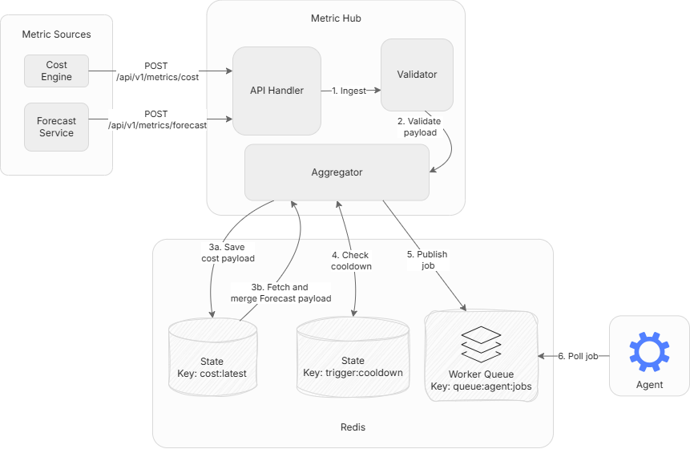
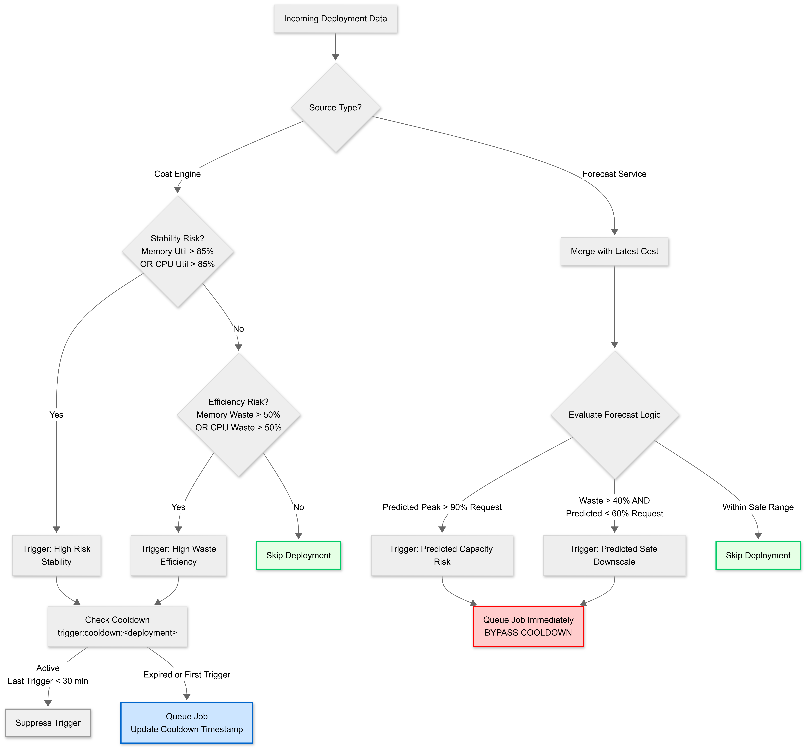

# Metric Hub
The Metric Hub is a high-throughput API gateway and state aggregator written in Go. It sits between the observability layer (Cost Engine, Forecast Service) and the agent, validating incoming metrics, merging asynchronous data streams, and dispatching optimisation jobs when thresholds are violated.

**In this document:**
* [Overview](#overview)
* [Design](#design)
* [Data Model](#data-model)
* [Threshold Evaluation](#threshold-evaluation)
* [Queue Dispatch](#queue-dispatch)
* [Cooldown Mechanism](#cooldown-mechanism)
* [Technical Implementations](#technical-implementation)
* [Error Handling](#error-handling)
* [Future Enhancements](#future-enhancements)

## Overview
The Metric Hub solves a coordination problem: the Cost Engine and Forecast Service operate independently at different update frequencies. The Cost Engine pushes data when resource requests change. The Forecast Service recalculates predictions every 4 hours. These asynchronous streams cannot be naively merged without introducing race conditions or stale data.

The Hub provides:
1. **Schema validation**: Rejects malformed payloads at ingestion
2. **State management**: Maintains the latest cost and forecast snapshots in Redis
3. **Stream merging**: Combines independent streams in memory when needed
4. **Threshold evaluation**: Applies business logic to detect waste or capacity risk
5. **Job dispatch**: Pushes deployments for optimisation as jobs to the queue

## Design


The Hub operates in a **synchronous-asynchronous split**:

**Synchronous Phase:**
1. Accept HTTP POST request
2. Validate JSON schema
3. Return `201 Created` immediately

**Asynchronous Phase (background Goroutine):**
1. Save payload to Redis (`cost:latest`)
2. If forecast payload: retrieve cost data, merge in memory
3. Evaluate each deployment against thresholds
4. Check cooldown windows
5. Dispatch jobs to queue

This design ensures upstream services never wait for expensive processing. The Hub returns success instantly, then handles evaluation in the background with a 10-second timeout context.

## Data Model
### Cost Engine Payload

**Endpoint:** `POST /api/v1/metrics/cost`
```json
{
  "timestamp": "2025-01-01T12:00:00Z",
  "namespace": "default",
  "cluster_info": {
    "vm_count": 3,
    "current_hourly_cost": 0.12
  },
  "deployments": [
    {
      "name": "currencyservice",
      "current_requests": {"cpu_cores": 0.512, "memory_mb": 512},
      "current_usage": {"cpu_cores": 0.033, "memory_mb": 115}
    }
  ]
}
```

**Validation Rules:**
- `timestamp` must be valid ISO 8601
- `namespace` must equal "default"
- `vm_count` must be > 0
- `cpu_cores`, `memory_mb` must be ≥ 0

### Forecast Service Payload
**Endpoint:** `POST /api/v1/metrics/forecast`
```json
{
  "timestamp": "2025-01-01T12:00:00Z",
  "namespace": "default",
  "deployments": [
    {
      "name": "currencyservice",
      "predicted_peak_24h": {"cpu_cores": 0.05, "memory_mb": 80}
    }
  ]
}
```

**Merge Logic:**  
When a forecast arrives, the Hub:
1. Retrieves `cost:latest` from Redis
2. Unmarshals the cost payload
3. Finds matching deployments by name
4. Attaches `predicted_peak_24h` field to the cost data
5. Evaluates the merged view

The merged result is **never stored**. It exists only in memory during threshold evaluation.


## Threshold Evaluation
The Hub applies **business logic**: stability checks run first, efficiency checks run second.




### Priority 1: Stability (Prevent Crashes)
| Trigger | Condition | Action |
|---------|-----------|--------|
| High Memory Risk | Memory util > 85% | Dispatch "High Memory Risk" job |
| High CPU Risk | CPU util > 85% | Dispatch "High CPU Risk" job |
| Predicted Capacity Risk (Memory) | Forecast > 90% of request | Dispatch "Predicted Capacity Risk (Memory)" job |
| Predicted Capacity Risk (CPU) | Forecast > 90% of request | Dispatch "Predicted Capacity Risk (CPU)" job |

### Priority 2: Efficiency (Reduce Waste)
| Trigger | Condition | Action |
|---------|-----------|--------|
| High Memory Waste | Memory waste > 50% | Dispatch "High Memory Waste" job |
| High CPU Waste | CPU waste > 50% | Dispatch "High CPU Waste" job |
| Safe Downscale (Memory) | Waste > 40% AND forecast < 60% of request | Dispatch "Safe Downscale (Memory)" job |
| Safe Downscale (CPU) | Waste > 40% AND forecast < 60% of request | Dispatch "Safe Downscale (CPU)" job |


**Waste Formula:**  
```
waste = (request - usage) / request
```

**Example:**  
- Request: 512m CPU, Usage: 100m CPU
- Waste: (512 - 100) / 512 = **80.5%** → Triggers "High CPU Waste"

### Forecast Triggers (Bypasses Cooldown)
When forecast data is available, the Hub also checks for proactive capacity risks:

| Trigger | Condition | Action |
|---------|-----------|--------|
| Predicted Capacity Risk (CPU) | Forecast CPU > 90% of current request | Dispatch "Predicted Capacity Risk (CPU)" job |
| Predicted Capacity Risk (Memory) | Forecast Memory > 90% of current request | Dispatch "Predicted Capacity Risk (Memory)" job |

These triggers **bypass the cooldown timer** because they represent new predictive intelligence rather than repeated observations of current state.


### Evaluation Order 
Each deployment is evaluated independently. A single cost payload containing 5 deployments might produce 0-5 jobs depending on which deployments cross thresholds.

## Queue Dispatch
Jobs are constructed as self-contained units of work. The `reason` field explicitly identifies why the optimisation was triggered, allowing the agent to apply trigger-specific logic:

```json
{
  "reason": "High Memory Waste",
  "namespace": "default",
  "cluster_info": {"vm_count": 3, "current_hourly_cost": 0.12}
  "deployments": {
    "name": "currencyservice",
    "current_requests": {"cpu_cores": 0.512, "memory_mb": 512},
    "current_usage": {"cpu_cores": 0.033, "memory_mb": 115}
  },
}
```
The reason for the trigger is attached to the job.

Jobs are pushed to the Redis List `queue:agent:jobs` via `LPUSH`. The agent consumes them via blocking pop (`BRPOP`).

**Decoupling Benefits:**
- Agent can be offline; jobs wait in queue
- Multiple agents could consume from the same queue (future work)
- Failed jobs can be inspected manually via Redis CLI


## Cooldown Mechanism
Without cooldown, the same deployment would trigger repeatedly as new metrics arrive, flooding the agent with redundant jobs.

**Cooldown Logic:**
1. Before dispatching a job, check Redis key: `trigger:cooldown:<deployment_name>`
2. If key exists and timestamp < 30 minutes ago: **suppress trigger**
3. If cooldown expired or key doesn't exist: **dispatch job**, update timestamp

**Exception: Forecast Triggers Bypass Cooldown**  
Forecast-derived alerts (e.g., "Predicted Capacity Risk") always dispatch immediately. Predictions represent **new information** about future risk, not a repeat of past conditions.

**Example:**
- 12:00 - `currencyservice` triggers "High Waste" -> Job dispatched, cooldown set
- 12:05 - Cost Engine pushes new data, still shows waste -> **Suppressed** (cooldown active)
- 12:35 - Cost Engine pushes data, still shows waste -> Job dispatched (cooldown expired)

This prevents oscillation while allowing the system to respond to persistent issues.

## Technical Implementation
**Language:** Go  
**Concurrency Model:** Goroutines + Context cancellation  
**Validation:** `go-playground/validator` with struct tags  
**State Store:** Redis (keys: `cost:latest`, `trigger:cooldown:<name>`)  
**Queue:** Redis List (`queue:agent:jobs`)  

**Key Design Decisions:**
- Stateless service (can run multiple replicas behind a load balancer)
- No authentication or rate limiting (deferred to production deployment)
- 10-second timeout on all background operations
- Strict schema validation before any processing

The Hub prioritises **correctness over speed**. Invalid payloads are rejected immediately. Valid payloads are processed asynchronously with timeout protection to prevent runaway operations.


## Error Handling
| Failure Mode | Behavior |
|--------------|----------|
| Invalid JSON | Return `400 Bad Request`, log error |
| Schema validation fails | Return `400 Bad Request`, log validation errors |
| Redis unavailable | Log error, return `500 Internal Server Error` |
| Timeout during evaluation | Log "evaluation cancelled", jobs already dispatched remain in queue |

**No Silent Failures:**  
All errors are logged to stdout with context (deployment name, trigger reason, error message). This enables debugging via `kubectl logs`.


## Future Enhancements
- **Priority Queues:** Separate queues for stability vs efficiency triggers
- **Rate Limiting:** Prevent upstream services from overwhelming the Hub
- **Authentication:** TLS or API key validation for production deployment
- **Metrics Export:** Expose Prometheus metrics (jobs dispatched, cooldowns active, validation failures)

The current design prioritises simplicity and testability. Production deployment would require these enhancements for security and observability.
