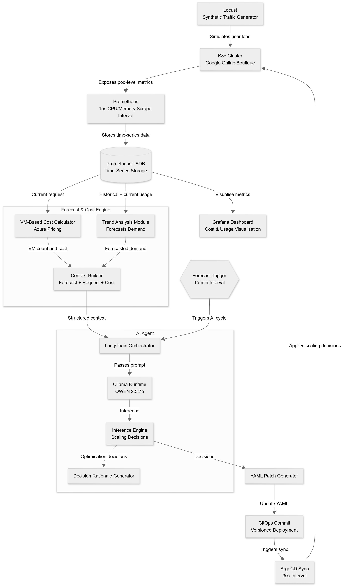

# Proposed Designs
This document outlines the main concern of the project, proposed designs, approaches that were rejected, challenges, trade-offs, and successful outcomes that produced significant results

In this document:
* [The Concern](#background)
* [Rejected Design: Proposed Architecture](#rejected-design-proposed-architecture)
* [Rejected Design: Polling Model](#rejected-design-polling-model)
* [Rejected Design: Direct Redis Consumption](#rejected-design-direct-redis-consumption)
* [Final Design: The Event-Driven Pipeline](#final-design-the-event-driven-pipeline)
* [Data Strategy: Capturing, Structuring, & Forwarding](#data-strategy)

## The Concern
There were a lot of uncertainties and questions that were raised on data flow through the system during project development and 
required on-the-fly learning and iterative experimentation while maitaining an agile approach.

Infrastructure has been provisioned, Prometheus scrapes data, Grafana provides visualisaton, Cost Engine and Forecast Service exposes the correct metrics
and is ready to be sent to the agent for optimisation.

But: **how exactly will this data reach the agent?**

In one sentence, the problem can be summarised as:

_"How will real-time data be captured, structured, stored, and forwarded to the agent for further action?"_

The document walks through the early ideas and approaches used to solve this problem, including what worked and what didn't. 

## Rejected Design: Proposed Architecture
**Status**: Rejected

**Reason**: The first architecture proposed at the start of the project simply has insufficient detail to show how the goal would actually be achieved. 

It presents the following questions:
* How will the Cost Engine and Forecast Service forward its data to the Context Builder?
* What kind of data will be sent to the Context Builder?
* How will the Context Builder formulate a structured context for the agent?
* How will the structured context be passed to the agent?
* If the agent triggers every 15 minutes, where will this context be stored?
* How will LangChain and Ollama integrate?
* How exactly will reasoning and decision-making be achieved?

Not only does this design add complexity, but also posed risks and disruptions. For instance, everytime the agent makes a bad decision and pushed to production, rolling back via `git revert` would be cumbersome and defeats the purpose of continuous delivery.

## Rejected Design: Polling Model
**Status**:  Rejected

**Reason**: The initial plan was to have the agent query Prometheus directly. 

However, it causes:
1.  **Tight Coupling:** It forces the agent to become a data pipeline, handling raw metric transformations
2.  **Race Conditions:** The Cost Engine updates every 15s, but Forecasts update every 4 hours. If the agent queries them independently, it risks acting on mismatched states
3.  **Complexity:** The agent would need to manually join these datasets every time it wanted to make a decision

## Rejected Design: Direct Redis Consumption
**Status**: Rejected

**Reason**: An alternative architecture considered having the Cost Engine and Forecast Service write independently to a shared Redis instance, allowing the agent to query both streams directly. This appeared simpler initially but was rejected after recognising the complexity it transfers onto the agent.

It causes:
1.  **Race Conditions:** The agent would have to handle cases where cost data updates while forecast data remains stale
2.  **Data Wrangling:** The agent would bear the responsibility for validating missing fields across two independent JSON sources and manually joining disparate datasets before every decision
3.  **Schema Consistency:** It would require enforcing schema consistency without coordination guarantees
4.  **Separation of Concerns:** The agent’s primary responsibility is **workload optimisation**, not data wrangling. The system requires a mechanism to guarantee data consistency and structural integrity *before* information reaches the agent

## Final Design: The Event-Driven Pipeline
**Status**: Accepted

**Reason**: The solution is to move to a **Push-based, Event-Driven Architecture**. Instead of the agent asking for data, wasting resources and bandwidth (in production), the **Metric Hub** acts as a central aggregator that pushes jobs to the agent only when action is needed.

Details on the Metric Hub design: [Metric Hub](./docs/metric-hub.md) 

## Data Strategy

### 1. Capturing Data (Push vs Pull)
Instead of the agent polling Prometheus, the idea is to implement a **Push Model**
* **Cost Engine:** Pushes real-time usage via HTTP POST 
* **Forecast Service:** Pushes prediction data via HTTP POST
* **Metric Hub:** sits in the middle, absorbing these asynchronous streams so the agent doesn't have to worry about timing

### 2. Structuring Data (Schema Validation)
Raw JSON is dangerous. A missing field or a string-instead-of-int could cause the LLM to hallucinate or the agent to crash
* **Solution:** Use Go Structs and the `go-playground/validator` library in the Metric Hub
* **Enforcement:** Any payload missing a `namespace` or containing negative CPU values is immediately rejected with `400 Bad Request`. Only valid, clean data enters the pipeline

### 3. Storing Data 
A way is needed to compare "Current Cost" (fast) with "Forecasted Risk" (slow)
* **Solution:** Redis was used as a shared state store
* **Mechanism:** The Aggregator stores the latest Cost snapshot in `cost:latest`. When a Forecast arrives, it retrieves the cost, merges the two views in memory, and creates a unified context

### 4. Forwarding Data (Queues)
Direct HTTP calls from the Hub to the agent would create tight coupling—if the agent is busy reasoning (which takes ~60s), the Hub would timeout
* **Solution:** A **Redis Work Queue** (`queue:agent:jobs`)
* **Benefit:** The Hub pushes a job and immediately returns `201 Created`. The agent uses `BRPOP` to process jobs at its own pace. This effectively decouples the Hub from the agent
